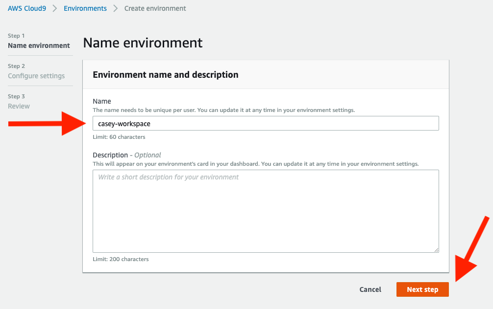
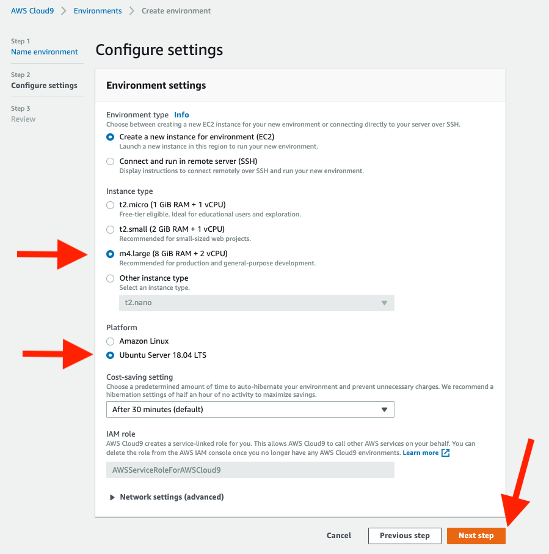
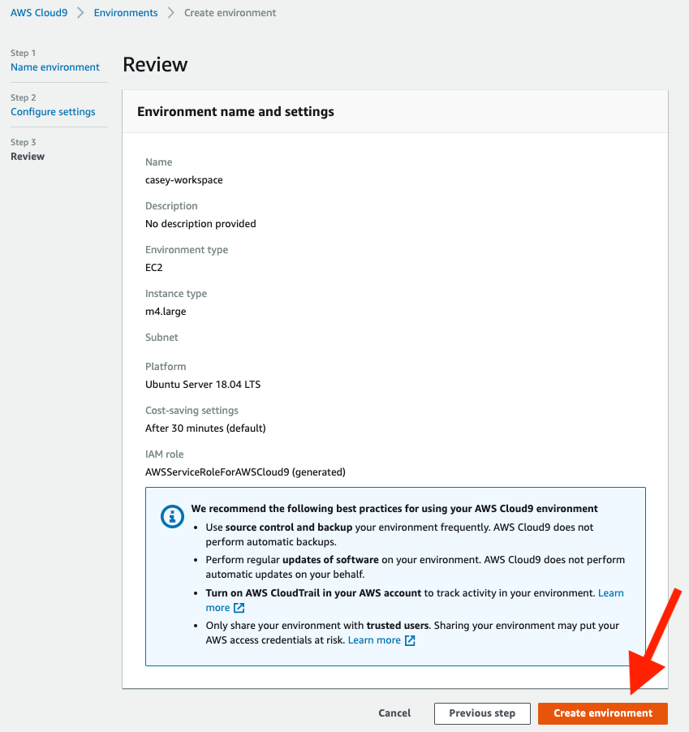

# Overview
This repo contains instructions for configuring a LEAD workspace.

# Provision Workspace

* [Create](https://console.aws.amazon.com/cloud9/home/create) a new AWS Cloud9 environment



* Choose `m4.large` for the **Instance type** and `Ubuntu Server 18.04 LTS` for the **Platform**
 


* Review and click **Create environment**



# Tooling setup

In the terminal, run:

```
    git clone https://github.com/liatrio/lead-workspace.git
    lead-workspace/setup.sh
```
